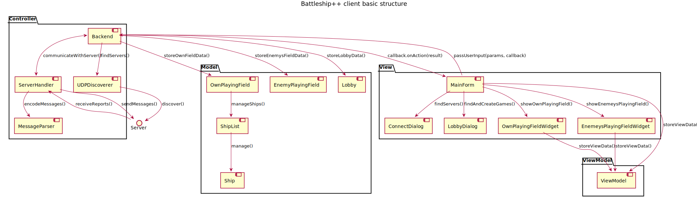

.. Battleship++ documentation master file, created by
   sphinx-quickstart on Sat Dec 12 16:42:02 2015.
   You can adapt this file completely to your liking, but it should at least
   contain the root `toctree` directive.

Welcome to Battleship++'s documentation!
========================================

Contents:

.. toctree::
   :maxdepth: 2

   common
   client
   server

Indices and tables
==================

* :ref:`genindex`
* :ref:`modindex`
* :ref:`search`

Client structure
================
